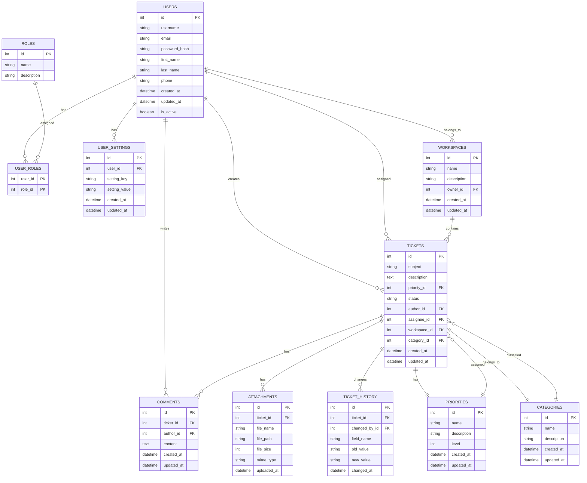

# Структура базы данных Service Desk системы

## Диаграмма схемы базы данных

## Описание таблиц

### 1. Таблица пользователей (USERS)

| Поле | Тип данных | Описание |
|------|------------|----------|
| id | SERIAL (PRIMARY KEY) | Уникальный идентификатор пользователя |
| username | VARCHAR(50) | Имя пользователя |
| email | VARCHAR(100) | Электронная почта пользователя |
| password_hash | VARCHAR(255) | Хэш пароля пользователя |
| first_name | VARCHAR(50) | Имя пользователя |
| last_name | VARCHAR(50) | Фамилия пользователя |
| phone | VARCHAR(20) | Номер телефона пользователя |
| created_at | TIMESTAMP | Дата и время создания записи |
| updated_at | TIMESTAMP | Дата и время последнего обновления записи |
| is_active | BOOLEAN | Флаг активности пользователя |

### 2. Таблица заявок (TICKETS)

| Поле | Тип данных | Описание |
|------|------------|----------|
| id | SERIAL (PRIMARY KEY) | Уникальный идентификатор заявки |
| subject | VARCHAR(255) | Тема заявки |
| description | TEXT | Описание заявки |
| priority_id | INTEGER (FOREIGN KEY) | Идентификатор приоритета |
| status | VARCHAR(50) | Статус заявки |
| author_id | INTEGER (FOREIGN KEY) | Идентификатор автора заявки |
| assignee_id | INTEGER (FOREIGN KEY) | Идентификатор исполнителя заявки |
| workspace_id | INTEGER (FOREIGN KEY) | Идентификатор рабочего пространства |
| category_id | INTEGER (FOREIGN KEY) | Идентификатор категории |
| created_at | TIMESTAMP | Дата и время создания заявки |
| updated_at | TIMESTAMP | Дата и время последнего обновления заявки |

### 3. Таблица комментариев к заявкам (COMMENTS)

| Поле | Тип данных | Описание |
|------|------------|----------|
| id | SERIAL (PRIMARY KEY) | Уникальный идентификатор комментария |
| ticket_id | INTEGER (FOREIGN KEY) | Идентификатор заявки |
| author_id | INTEGER (FOREIGN KEY) | Идентификатор автора комментария |
| content | TEXT | Содержание комментария |
| created_at | TIMESTAMP | Дата и время создания комментария |
| updated_at | TIMESTAMP | Дата и время последнего обновления комментария |

### 4. Таблица прикрепленных файлов (ATTACHMENTS)

| Поле | Тип данных | Описание |
|------|------------|----------|
| id | SERIAL (PRIMARY KEY) | Уникальный идентификатор файла |
| ticket_id | INTEGER (FOREIGN KEY) | Идентификатор заявки |
| file_name | VARCHAR(255) | Имя файла |
| file_path | VARCHAR(500) | Путь к файлу |
| file_size | INTEGER | Размер файла в байтах |
| mime_type | VARCHAR(100) | MIME-тип файла |
| uploaded_at | TIMESTAMP | Дата и время загрузки файла |

### 5. Таблица ролей пользователей (ROLES)

| Поле | Тип данных | Описание |
|------|------------|----------|
| id | SERIAL (PRIMARY KEY) | Уникальный идентификатор роли |
| name | VARCHAR(50) | Название роли (admin, agent, client) |
| description | TEXT | Описание роли |

### 6. Таблица рабочих пространств (WORKSPACES)

| Поле | Тип данных | Описание |
|------|------------|----------|
| id | SERIAL (PRIMARY KEY) | Уникальный идентификатор рабочего пространства |
| name | VARCHAR(100) | Название рабочего пространства |
| description | TEXT | Описание рабочего пространства |
| owner_id | INTEGER (FOREIGN KEY) | Идентификатор владельца рабочего пространства |
| created_at | TIMESTAMP | Дата и время создания |
| updated_at | TIMESTAMP | Дата и время последнего обновления |

### 7. Таблица истории изменений заявок (TICKET_HISTORY)

| Поле | Тип данных | Описание |
|------|------------|----------|
| id | SERIAL (PRIMARY KEY) | Уникальный идентификатор записи истории |
| ticket_id | INTEGER (FOREIGN KEY) | Идентификатор заявки |
| changed_by_id | INTEGER (FOREIGN KEY) | Идентификатор пользователя, внесшего изменения |
| field_name | VARCHAR(50) | Название измененного поля |
| old_value | TEXT | Предыдущее значение поля |
| new_value | TEXT | Новое значение поля |
| changed_at | TIMESTAMP | Дата и время изменения |

### 8. Таблица настроек пользователей (USER_SETTINGS)

| Поле | Тип данных | Описание |
|------|------------|----------|
| id | SERIAL (PRIMARY KEY) | Уникальный идентификатор настройки |
| user_id | INTEGER (FOREIGN KEY) | Идентификатор пользователя |
| setting_key | VARCHAR(100) | Ключ настройки |
| setting_value | TEXT | Значение настройки |
| created_at | TIMESTAMP | Дата и время создания |
| updated_at | TIMESTAMP | Дата и время последнего обновления |

### 9. Таблица категорий заявок (CATEGORIES)

| Поле | Тип данных | Описание |
|------|------------|----------|
| id | SERIAL (PRIMARY KEY) | Уникальный идентификатор категории |
| name | VARCHAR(100) | Название категории |
| description | TEXT | Описание категории |
| created_at | TIMESTAMP | Дата и время создания |
| updated_at | TIMESTAMP | Дата и время последнего обновления |

### 10. Таблица приоритетов заявок (PRIORITIES)

| Поле | Тип данных | Описание |
|------|------------|----------|
| id | SERIAL (PRIMARY KEY) | Уникальный идентификатор приоритета |
| name | VARCHAR(50) | Название приоритета |
| description | TEXT | Описание приоритета |
| level | INTEGER | Уровень приоритета (чем выше число, тем выше приоритет) |
| created_at | TIMESTAMP | Дата и время создания |
| updated_at | TIMESTAMP | Дата и время последнего обновления |

## Связи между таблицами

1. **USERS ↔ TICKETS** (1:M)
   - Один пользователь может создать множество заявок (author_id)
   - Один пользователь может быть исполнителем множества заявок (assignee_id)

2. **USERS ↔ USER_ROLES** (1:M)
   - Один пользователь может иметь несколько ролей

3. **ROLES ↔ USER_ROLES** (1:M)
   - Одна роль может быть назначена множеству пользователей

4. **USERS ↔ COMMENTS** (1:M)
   - Один пользователь может написать множество комментариев

5. **TICKETS ↔ COMMENTS** (1:M)
   - Одна заявка может иметь множество комментариев

6. **TICKETS ↔ ATTACHMENTS** (1:M)
   - Одна заявка может иметь множество прикрепленных файлов

7. **TICKETS ↔ TICKET_HISTORY** (1:M)
   - Одна заявка может иметь множество записей в истории изменений

8. **USERS ↔ USER_SETTINGS** (1:1)
   - Один пользователь имеет одну запись настроек

9. **WORKSPACES ↔ USERS** (1:M)
   - Одно рабочее пространство может содержать множество пользователей

10. **WORKSPACES ↔ TICKETS** (1:M)
    - Одно рабочее пространство может содержать множество заявок

11. **PRIORITIES ↔ TICKETS** (1:M)
    - Один приоритет может быть назначен множеству заявок

12. **CATEGORIES ↔ TICKETS** (1:M)
    - Одна категория может содержать множество заявок

## Индексы для оптимизации запросов

1. **USERS**
   - PRIMARY KEY (id)
   - UNIQUE INDEX (username)
   - UNIQUE INDEX (email)
   - INDEX (is_active)

2. **TICKETS**
   - PRIMARY KEY (id)
   - INDEX (author_id)
   - INDEX (assignee_id)
   - INDEX (status)
   - INDEX (priority_id)
   - INDEX (workspace_id)
   - INDEX (category_id)
   - INDEX (created_at)

3. **COMMENTS**
   - PRIMARY KEY (id)
   - INDEX (ticket_id)
   - INDEX (author_id)
   - INDEX (created_at)

4. **ATTACHMENTS**
   - PRIMARY KEY (id)
   - INDEX (ticket_id)
   - INDEX (uploaded_at)

5. **USER_ROLES**
   - PRIMARY KEY (user_id, role_id)
   - INDEX (user_id)
   - INDEX (role_id)

6. **TICKET_HISTORY**
   - PRIMARY KEY (id)
   - INDEX (ticket_id)
   - INDEX (changed_by_id)
   - INDEX (changed_at)

7. **WORKSPACES**
   - PRIMARY KEY (id)
   - INDEX (owner_id)

8. **USER_SETTINGS**
   - PRIMARY KEY (id)
   - UNIQUE INDEX (user_id, setting_key)
   - INDEX (user_id)

9. **CATEGORIES**
   - PRIMARY KEY (id)

10. **PRIORITIES**
    - PRIMARY KEY (id)
    - INDEX (level)

## Ограничения целостности данных

1. **NOT NULL Constraints**
   - Все поля id
   - username, email в таблице USERS
   - subject в таблице TICKETS
   - content в таблице COMMENTS
   - file_name, file_path в таблице ATTACHMENTS
   - name в таблицах ROLES, CATEGORIES, PRIORITIES
   - setting_key, setting_value в таблице USER_SETTINGS
   - field_name, old_value, new_value в таблице TICKET_HISTORY

2. **FOREIGN KEY Constraints**
   - TICKETS.author_id → USERS.id
   - TICKETS.assignee_id → USERS.id
   - TICKETS.priority_id → PRIORITIES.id
   - TICKETS.workspace_id → WORKSPACES.id
   - TICKETS.category_id → CATEGORIES.id
   - COMMENTS.ticket_id → TICKETS.id
   - COMMENTS.author_id → USERS.id
   - ATTACHMENTS.ticket_id → TICKETS.id
   - USER_ROLES.user_id → USERS.id
   - USER_ROLES.role_id → ROLES.id
   - TICKET_HISTORY.ticket_id → TICKETS.id
   - TICKET_HISTORY.changed_by_id → USERS.id
   - USER_SETTINGS.user_id → USERS.id
   - WORKSPACES.owner_id → USERS.id

3. **UNIQUE Constraints**
   - USERS.username
   - USERS.email
   - USER_SETTINGS(user_id, setting_key)
   - USER_ROLES(user_id, role_id)

4. **CHECK Constraints**
   - USERS.is_active IN (true, false)
   - TICKETS.status в допустимом списке значений (например, 'open', 'in_progress', 'resolved', 'closed')
   - ATTACHMENTS.file_size >= 0
   - PRIORITIES.level >= 0