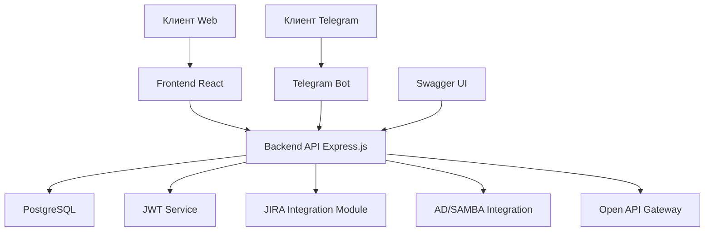

# Архитектурный план MVP Service Desk системы

## Диаграмма компонентов системы

## Взаимодействие между компонентами

1.  **Клиент Web** взаимодействует с **Frontend React**, который, в свою очередь, отправляет запросы к **Backend API Express.js**.
2.  **Клиент Telegram** взаимодействует с **Telegram Bot**, который также отправляет запросы к **Backend API Express.js**.
3.  **Backend API Express.js** обрабатывает запросы, взаимодействуя с **PostgreSQL** для хранения данных.
4.  Для аутентификации и авторизации **Backend API Express.js** использует **JWT Service**.
5.  **Backend API Express.js** интегрируется с **JIRA Integration Module** для синхронизации заявок.
6.  **Backend API Express.js** использует **AD/SAMBA Integration** для авторизации сотрудников.
7.  **Backend API Express.js** предоставляет **Open API Gateway** для кастомных интеграций.
8.  **Swagger UI** предоставляет документацию API, взаимодействуя с **Backend API Express.js**.

## Технические спецификации компонентов

### Frontend (React)

*   **Фреймворк**: React 18+
*   **Язык**: TypeScript
*   **Состояние**: Redux Toolkit
*   **Стили**: CSS Modules или Styled Components
*   **Маршрутизация**: React Router
*   **HTTP-клиент**: Axios

### Backend API (Express.js)

*   **Фреймворк**: Express.js 4+
*   **Язык**: Node.js 18+
*   **База данных**: PostgreSQL 12+
*   **ORM**: Sequelize или Prisma
*   **Аутентификация**: JWT
*   **Документация API**: Swagger (OpenAPI 3.0)
*   **Логирование**: Winston
*   **Тестирование**: Jest, Supertest

### PostgreSQL

*   **Версия**: 12+
*   **Хостинг**: Локальный или облачный (например, AWS RDS, Google Cloud SQL)
*   **Резервное копирование**: pg_dump, WAL-G
*   **Мониторинг**: pg_stat_statements, Prometheus

### Telegram Bot

*   **Библиотека**: node-telegram-bot-api
*   **Взаимодействие с Backend**: REST API или Webhooks
*   **Обработка команд**: Создание заявок, просмотр статуса

### JWT Service

*   **Библиотека**: jsonwebtoken
*   **Алгоритм**: RS256 (асимметричный) или HS256 (симметричный)
*   **Срок действия токена**: Настраиваемый (например, 1 час для access token, 7 дней для refresh token)
*   **Хранение refresh token'ов**: В базе данных (PostgreSQL)

### Swagger UI

*   **Интеграция**: swagger-jsdoc, swagger-ui-express
*   **Документация**: Автоматически генерируется из JSDoc комментариев в коде
*   **Доступ**: Доступен по определенному маршруту (например, /api-docs)

### JIRA Integration Module

*   **API**: JIRA REST API
*   **Аутентификация**: API token или OAuth
*   **Функционал**: Создание, обновление, синхронизация заявок
*   **Конфигурация**: Настраиваемые правила синхронизации

### AD/SAMBA Integration

*   **Библиотека**: ldapjs или activedirectory
*   **Протокол**: LDAP
*   **Функционал**: Аутентификация пользователей, получение информации о пользователях
*   **Конфигурация**: Настройки сервера AD, учетные данные для подключения

### Open API Gateway

*   **Доступ**: REST API с документацией в формате OpenAPI
*   **Аутентификация**: API ключи или OAuth
*   **Rate Limiting**: Ограничение количества запросов
*   **Логирование**: Логирование всех запросов и ответов

## Рекомендации по развертыванию

1.  **Локальная разработка**:
    *   Использовать Docker Compose для запуска всех сервисов локально.
    *   Использовать .env файлы для управления конфигурацией.
    *   Использовать nodemon для автоматической перезагрузки сервера при изменении кода.

2.  **Тестирование**:
    *   Использовать Jest для модульного тестирования.
    *   Использовать Cypress или Playwright для end-to-end тестирования.
    *   Использовать инструменты линтера (ESLint, Prettier) для обеспечения качества кода.

3.  **Продакшн**:
    *   Использовать Docker и Kubernetes для оркестрации контейнеров.
    *   Использовать NGINX в качестве reverse proxy и load balancer.
    *   Использовать Let's Encrypt для SSL сертификатов.
    *   Использовать облачные сервисы для базы данных (например, AWS RDS).
    *   Настроить мониторинг (Prometheus, Grafana) и алертинг (Alertmanager).

## План масштабирования

1.  **Вертикальное масштабирование**:
    *   Увеличение ресурсов сервера (CPU, RAM) при увеличении нагрузки.

2.  **Горизонтальное масштабирование**:
    *   Использование кластера Node.js для распределения нагрузки между несколькими экземплярами приложения.
    *   Использование балансировщика нагрузки (например, NGINX, HAProxy).

3.  **Масштабирование базы данных**:
    *   Репликация PostgreSQL (мастер-слейв) для распределения нагрузки на чтение.
    *   Шардинг для распределения данных по нескольким серверам.

4.  **Кэширование**:
    *   Использование Redis для кэширования часто запрашиваемых данных.
    *   Использование CDN для статических ресурсов (изображения, CSS, JS).

5.  **Микросервисы**:
    *   При дальнейшем росте системы рассмотреть возможность разделения монолитного приложения на микросервисы (например, отдельные сервисы для аутентификации, заявок, интеграций).