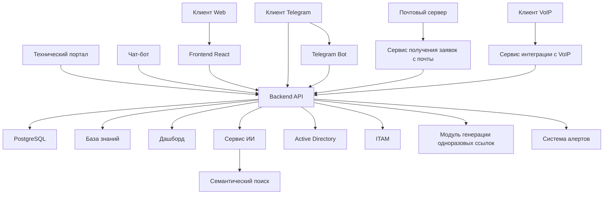

# План разработки Service Desk системы

## Обзор проекта

Система управления заявками (Service Desk) с веб-интерфейсом, интеграцией с Telegram, обработкой обращений через электронную почту, мессенджеры, телефонию и интеграцией с VoIP. Система предоставляет пользователям возможность создавать, отслеживать и управлять заявками через различные каналы связи. Включает функции категоризации обращений, настраиваемого Workflow, умного балансировщика обращений, календаря событий, сводных отчетов, профилей пользователей, кастомизируемых дашбордов, модуля генерации одноразовых ссылок, оценки качества обращений и аналитики, технического портала, чат-бота и ITAM. Доступна в виде облачного решения и коробочной версии.

Система также включает интерактивный дашборд аналитики с ключевыми метриками, систему сбора и анализа метрик, автоматическую генерацию еженедельных отчетов и систему алертов для мониторинга критических ситуаций в реальном времени.

## Фазы реализации

### Фаза 1: Базовая функциональность (MVP)

#### Минимальный функционал:
- Создание и просмотр заявок
- Система ролей (админ, агент, клиент)
- Базовая аутентификация и авторизация
- Комментарии к заявкам
- Загрузка файлов к заявкам
- Уведомления о новых заявках и изменениях статуса
- Обработка обращений через веб-интерфейс
- Обработка обращений через Telegram
- Обработка обращений через электронную почту
- Базовая форма обратной связи
- Разграничение рабочих пространств
- Портал самообслуживания
- Функционал согласования
- Автоматизированные маршруты заявок
- Приоритеты заявок
- Open API для кастомных интеграций
- Готовый модуль для двухсторонней интеграции с JIRA
- Интеграция с AD - SAMBA для авторизации сотрудников
- Подтягивание правильных контактов в заявку из AD

#### Пользовательские истории:
1. Как клиент, я хочу создать заявку, чтобы сообщить о проблеме.
2. Как клиент, я хочу прикрепить файл к заявке, чтобы предоставить дополнительную информацию.
3. Как клиент, я хочу просматривать статус своих заявок, чтобы отслеживать прогресс.
4. Как агент, я хочу просматривать список всех заявок, чтобы обрабатывать их.
5. Как агент, я хочу добавлять комментарии к заявкам, чтобы взаимодействовать с клиентом.
6. Как админ, я хочу управлять пользователями и их ролями, чтобы контролировать доступ к системе.
7. Как клиент, я хочу отправлять заявку через Telegram, чтобы не использовать веб-интерфейс.
8. Как клиент, я хочу отправлять заявку по электронной почте, чтобы не использовать веб-интерфейс.
9. Как клиент, я хочу использовать форму обратной связи для отправки заявки, чтобы быстро сообщить о проблеме.
10. Как админ, я хочу разграничивать рабочие пространства для разных отделов, чтобы изолировать данные.
11. Как клиент, я хочу использовать портал самообслуживания для решения простых задач, чтобы не ждать ответа от службы поддержки.
12. Как менеджер, я хочу настраивать правила утверждения заявок, чтобы автоматизировать процессы.
13. Как админ, я хочу настраивать автоматизированные маршруты заявок, чтобы оптимизировать процессы.
14. Как клиент, я хочу выбирать приоритет заявки, чтобы указать срочность.
15. Как разработчик, я хочу использовать Open API для кастомных интеграций, чтобы интегрировать собственные решения.
16. Как менеджер, я хочу использовать готовый модуль для двухсторонней интеграции с JIRA, чтобы синхронизировать задачи.
17. Как сотрудник, я хочу авторизовываться под своим логином/паролем на техпортале и в системе через AD - SAMBA, чтобы не создавать отдельные учетные записи.
18. Как клиент, я хочу, чтобы правильные контакты подтягивались в заявку из AD, чтобы не вводить их вручную.

#### Технические требования:
- Backend API на Express.js с PostgreSQL
- Frontend на React
- Telegram бот для работы с заявками
- JWT для аутентификации
- Swagger для документации API
- Open API для кастомных интеграций
- Модуль для двухсторонней интеграции с JIRA
- Интеграция с AD - SAMBA для авторизации сотрудников

### Фаза 2: Расширенные функции

#### Расширенный функционал:
- Приоритеты и категории заявок
- История изменений заявок
- Поиск и фильтрация заявок
- Отчеты и статистика
- Интеграция с внешними системами (Active Directory)
- Гибкая система утверждения заявок
- Получение заявок с почты
- База знаний
- Дашборд для отображения метрик и KPI
- Категоризация обращений (умный парсер, ИИ, ручная)
- Настраиваемый Workflow
- Умный балансировщик обращений
- Календарь событий
- Группы прав пользователей
- Сводные отчеты
- Профили пользователей
- Кастомизируемые дашборды
- Модуль генерации одноразовых ссылок
- Оценка качества обращений и аналитика
- Технический портал
- Чат-бот
- ITAM
- Интерактивный дашборд аналитики
- Система сбора и анализа метрик
- Автоматическая генерация еженедельных отчетов
- Система алертов для мониторинга критических ситуаций
- Разграничение рабочих пространств
- Настройки SLA/KPI
- Учет трудозатрат
- Конструктор отчетов
- API для чат-ботов
- Модуль CMDB
- Настройка видимости разделов согласно роли
- Группы агентов с ручным наполнением и указанием категорий

#### Пользовательские истории:
1. Как клиент, я хочу выбирать приоритет заявки, чтобы указать срочность.
2. Как агент, я хочу фильтровать заявки по категории и приоритету, чтобы эффективно их обрабатывать.
3. Как админ, я хочу просматривать отчеты по заявкам, чтобы анализировать эффективность работы.
4. Как админ, я хочу настраивать правила утверждения заявок, чтобы автоматизировать процессы.
5. Как клиент, я хочу отправлять заявку по электронной почте, чтобы не использовать веб-интерфейс.
6. Как агент, я хочу использовать базу знаний для быстрого поиска решений, чтобы быстрее обрабатывать заявки.
7. Как менеджер, я хочу просматривать дашборд с метриками и KPI, чтобы отслеживать эффективность работы сервис деска.
8. Как клиент, я хочу, чтобы моя заявка автоматически категоризировалась, чтобы не тратить время на ручное заполнение.
9. Как админ, я хочу настраивать Workflow для разных типов заявок, чтобы оптимизировать процессы.
10. Как менеджер, я хочу использовать умный балансировщик обращений, чтобы равномерно распределять нагрузку между агентами.
11. Как пользователь, я хочу получать уведомления о запланированных событиях, чтобы быть в курсе важных событий.
12. Как админ, я хочу настраивать группы прав пользователей для разных сервисов, чтобы контролировать доступ.
13. Как аналитик, я хочу создавать сводные отчеты, чтобы анализировать эффективность работы.
14. Как пользователь, я хочу сохранять свои настройки и отчеты в профиле, чтобы не настраивать их каждый раз.
15. Как менеджер, я хочу настраивать кастомизируемые дашборды, чтобы видеть нужную информацию.
16. Как админ, я хочу использовать модуль генерации одноразовых ссылок, чтобы безопасно передавать персональные данные.
17. Как клиент, я хочу оценивать качество обработки моих обращений, чтобы улучшить сервис.
18. Как пользователь, я хочу использовать технический портал для самообслуживания, чтобы решать простые задачи самостоятельно.
19. Как клиент, я хочу использовать чат-бот для быстрой связи, чтобы не ждать ответа по почте.
20. Как админ, я хочу использовать ITAM для учета оборудования, чтобы отслеживать ресурсы.
21. Как аналитик, я хочу просматривать интерактивный дашборд с ключевыми метриками системы, чтобы отслеживать состояние системы в реальном времени.
22. Как админ, я хочу получать уведомления о критических ситуациях, чтобы оперативно реагировать на проблемы.
23. Как менеджер, я хочу получать еженедельные отчеты по ключевым метрикам, чтобы анализировать эффективность работы.
24. Как админ, я хочу разграничивать рабочие пространства для разных отделов, чтобы изолировать данные.
25. Как менеджер, я хочу настраивать SLA и KPI для разных типов заявок, чтобы контролировать качество обслуживания.
26. Как аналитик, я хочу учитывать трудозатраты по заявкам, чтобы анализировать эффективность работы.
27. Как менеджер, я хочу использовать конструктор отчетов, чтобы создавать индивидуальные отчеты.
28. Как разработчик, я хочу использовать API для чат-ботов, чтобы интегрировать собственные решения.
29. Как админ, я хочу использовать модуль CMDB, чтобы управлять конфигурациями IT-ресурсов.
30. Как админ, я хочу настраивать видимость разделов согласно роли, чтобы контролировать доступ пользователей.
31. Как менеджер, я хочу создавать группы агентов и вручную наполнять их, указывая категории, чтобы заявки нужной категории приходили нужным агентам.

#### Технические требования:
- Расширенная схема базы данных
- Механизмы поиска и фильтрации
- Система отчетов и аналитики
- Интеграция с Active Directory
- Расширяемая архитектура для новых интеграций

### Фаза 3: Интеграции и ИИ (на будущее)

#### Будущие расширения:
- Интеграция с ИИ для автоматической классификации заявок
- Семантический поиск по заявкам
- Машинное обучение для предиктивной аналитики
- Мобильное приложение
- Чат-боты для других платформ

#### Пользовательские истории:
1. Как клиент, я хочу получать автоматические предложения по решению проблемы на основе ИИ.
2. Как агент, я хочу использовать семантический поиск для быстрого нахождения похожих заявок.
3. Как админ, я хочу использовать предиктивную аналитику для планирования ресурсов.

#### Технические требования:
- Микросервис ИИ для классификации заявок
- Семантический поиск на основе векторных представлений
- Мобильное приложение на React Native
- Расширяемая архитектура для интеграции с ИИ

## Архитектура системы

## Требования к инфраструктуре

- Node.js 18+
## Варианты обработки обращений

### Вариант 1: Без ИИ

#### Шаг 1: Поступление обращения
- Кто-то отправляет обращение через форму обратной связи (например, через бота или почту). Это может быть запрос на предоставление услуги или решение задачи.

#### Шаг 2: Обработка обращения
- Сотрудник получает уведомление о поступившем обращении.
- Сотрудник проверяет, нужно ли согласование для этого обращения:
  - Если не нужно согласования, то сотрудник сразу назначает исполнителя и передает обращение на выполнение.
  - Если нужно согласование, то процесс переходит к следующему шагу.

#### Шаг 3: Запрос согласования
- Сотрудник отправляет запрос на согласование соответствующей группе согласующих.
- Группа согласующих получает уведомление о необходимости принять решение:
  - Согласовать: Если группа согласовывает, статус обращения меняется на "согласовано".
  - Отказать: Если группа отказывает, статус меняется на "отказано", и сотруднику выдается уведомление о причине отказа.
  - Требуется дополнительная информация: Если группа требует больше информации, сотрудник получает запрос на уточнение деталей.

#### Шаг 4: Уточнение информации (при необходимости)
- Если требуется дополнительная информация, сотрудник запрашивает ее у заявителя (или других заинтересованных лиц).
- После получения информации процесс возвращается на шаг 3 для повторного согласования.

#### Шаг 5: Назначение исполнителя
- Если обращение согласовано, оно автоматически назначается на исполнителя (группу исполнителей), которая занимается решением данного типа задач/услуг.

#### Шаг 6: Предоставление доступа и закрытие обращения
- Исполнители выполняют необходимые действия (например, предоставляют доступ, решают проблему и т. д.).
- После выполнения работы статус обращения меняется на "закрыто".

### Вариант 2: С ИИ

#### Шаг 1: Поступление обращения
- Как и в первом варианте, кто-то отправляет обращение через форму обратной связи.

#### Шаг 2: Анализ запроса ИИ
- Искусственный интеллект (ИИ) анализирует содержание обращения и определяет:
  - Тип запроса (например, настройка сервиса, поддержка принтера, доступ к базе данных и т. д.).
  - Необходимость согласования.
  - Приоритетность запроса (например, высокий, средний, низкий).
  - Кого следует назначить исполнителем.

#### Шаг 3: Определение необходимости доступа
- ИИ проверяет, нужен ли доступ для выполнения запроса:
  - Если доступ не нужен, процесс переходит к шагу 5.
  - Если доступ нужен, ИИ проверяет, согласован ли он:
    - Если согласован, процесс переходит к шагу 5.
    - Если не согласован, ИИ направляет запрос на согласование.

#### Шаг 4: Согласование (если требуется)
- Если ИИ определил, что требуется согласование:
  - Система отправляет запрос на согласование соответствующей группе согласующих.
  - Группа согласующих принимает одно из решений:
    - Согласовать: Процесс переходит к шагу 5.
    - Отказать: ИИ уведомляет заявителя о причине отказа.
    - Требуется дополнительная информация: ИИ запрашивает уточнения у заявителя.

#### Шаг 5: Назначение исполнителя и выполнение
- После того как все условия выполнены (согласование, предоставление доступа и т. д.), ИИ автоматически назначает исполнителя.
- Исполнитель выполняет работу, и статус обращения меняется на "закрыто".

### Основные отличия между вариантами

1. Первый вариант:
   - Человек вручную проверяет необходимость согласования и назначает исполнителя.
   - Процесс более ручной и зависит от действий сотрудников.

2. Вариант с ИИ:
   - ИИ автоматически анализирует запрос, определяет необходимость согласования, назначает исполнителя и управляет процессом.
   - Процесс более автоматизирован и быстрый.

## ITAM (IT Asset Management)

Автоматизированный учет оборудования с агентом на клиентских машинах и автоинвентаризацией.

## Технический портал и чат-бот

Технический портал для самообслуживания и чат-бот для быстрой связи с пользователями.

## Модуль генерации одноразовых ссылок

Модуль для безопасной передачи персональных данных с возможностью отправки писем каждому адресату отдельно.

## Оценка качества обращений и аналитика

Оценка качества обращений и аналитика (включая NPS), кастомные анкетирования и рассылки по справочнику. Учет трудозатрат, шаблоны ответов и уведомлений.
- PostgreSQL 12+
- Docker (для развертывания)
- Сервер для размещения (локальный или облачный)

## План развертывания

1. Локальная разработка и тестирование
2. Тестирование в изолированной среде
3. Развертывание в продакшн среде
4. Мониторинг и поддержка

## Риски и ограничения

- Зависимость от внешних сервисов (Telegram, Active Directory)
- Сложность масштабирования при большом количестве заявок
- Необходимость обучения пользователей работе с системой