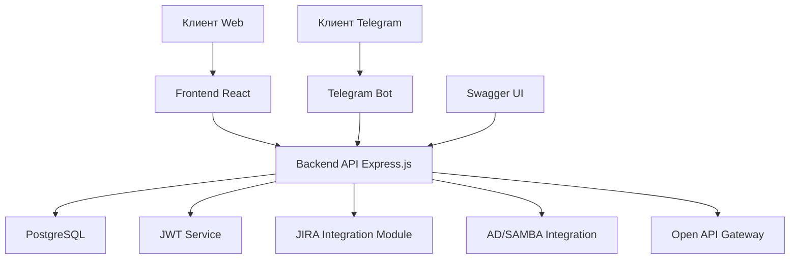

# Проектная документация Service Desk системы

## 1. Обзор архитектуры системы

### Диаграмма компонентов системы



### Взаимодействие между компонентами

1. **Клиент Web** взаимодействует с **Frontend React**, который, в свою очередь, отправляет запросы к **Backend API Express.js**.
2. **Клиент Telegram** взаимодействует с **Telegram Bot**, который также отправляет запросы к **Backend API Express.js**.
3. **Backend API Express.js** обрабатывает запросы, взаимодействуя с **PostgreSQL** для хранения данных.
4. Для аутентификации и авторизации **Backend API Express.js** использует **JWT Service**.
5. **Backend API Express.js** интегрируется с **JIRA Integration Module** для синхронизации заявок.
6. **Backend API Express.js** использует **AD/SAMBA Integration** для авторизации сотрудников.
## 2. Технические требования к компонентам

### 2.1. Серверная часть (Express.js, PostgreSQL)

#### Express.js
- **Фреймворк**: Express.js 4+
- **Язык программирования**: Node.js 18+
- **Основные функции**:
  - Обработка HTTP-запросов и ответов
  - Маршрутизация API
  - Middleware для обработки запросов (парсинг JSON, CORS, логирование)
  - Интеграция с PostgreSQL для хранения данных
  - Интеграция с JWT для аутентификации и авторизации
  - Интеграция с JIRA для синхронизации заявок
  - Интеграция с Active Directory (SAMBA) для авторизации сотрудников
  - Предоставление Open API Gateway для кастомных интеграций
- **Документация API**: Swagger (OpenAPI 3.0)
- **Логирование**: Winston
- **Тестирование**: Jest, Supertest

#### PostgreSQL
- **Версия**: PostgreSQL 12+
- **Функции**:
  - Хранение данных пользователей
  - Хранение заявок
  - Хранение refresh token'ов
  - Хранение конфигурации системы
- **Хостинг**: Локальный или облачный (например, AWS RDS, Google Cloud SQL)
- **Резервное копирование**: pg_dump, WAL-G
- **Мониторинг**: pg_stat_statements, Prometheus

### 2.2. Клиентская часть (React)

- **Фреймворк**: React 18+
- **Язык**: TypeScript
- **Управление состоянием**: Redux Toolkit
- **Стили**: CSS Modules или Styled Components
- **Маршрутизация**: React Router
- **HTTP-клиент**: Axios
- **Основные функции**:
  - Отображение интерфейса пользователя
  - Взаимодействие с Backend API через REST API
  - Аутентификация и авторизация пользователей
  - Создание, просмотр и управление заявками
  - Отображение статуса заявок
  - Интеграция с системой уведомлений

### 2.3. Telegram бот

- **Библиотека**: node-telegram-bot-api
- **Взаимодействие с Backend**: REST API или Webhooks
- **Основные функции**:
  - Прием команд от пользователей
  - Создание заявок через Telegram
  - Просмотр статуса заявок
  - Уведомления о статусе заявок
- **Обработка команд**:
  - `/start` - приветствие и инструкции
  - `/create_ticket` - создание новой заявки
  - `/ticket_status` - просмотр статуса заявки
  - `/help` - помощь и поддержка

### 2.4. Аутентификация и авторизация (JWT)

- **Библиотека**: jsonwebtoken
- **Алгоритм**: RS256 (асимметричный) или HS256 (симметричный)
- **Токены**:
  - **Access token**: срок действия 1 час
  - **Refresh token**: срок действия 7 дней
- **Хранение refresh token'ов**: В базе данных (PostgreSQL)
- **Функции**:
  - Выдача токенов при успешной аутентификации
  - Проверка валидности токенов
  - Обновление токенов
  - Отзыв токенов при выходе пользователя

### 2.5. API документация (Swagger)

- **Интеграция**: swagger-jsdoc, swagger-ui-express
- **Документация**: Автоматически генерируется из JSDoc комментариев в коде
- **Доступ**: Доступен по маршруту /api-docs
- **Формат**: OpenAPI 3.0
- **Функции**:
  - Описание всех API endpoint'ов
  - Примеры запросов и ответов
  - Описание параметров и моделей данных
  - Возможность тестирования API прямо из интерфейса Swagger

### 2.6. Интеграция с JIRA

- **API**: JIRA REST API
- **Аутентификация**: API token или OAuth
- **Функции**:
  - Создание заявок в JIRA
  - Обновление статуса заявок в JIRA
  - Синхронизация заявок между Service Desk и JIRA
- **Конфигурация**:
  - Настройки сервера JIRA
  - Учетные данные для подключения
  - Правила синхронизации (например, какие поля синхронизировать, как сопоставлять статусы)

### 2.7. Интеграция с Active Directory (SAMBA)

- **Библиотека**: ldapjs или activedirectory
- **Протокол**: LDAP
- **Функции**:
  - Аутентификация пользователей через Active Directory
  - Получение информации о пользователях (имя, email, подразделение)
  - Синхронизация пользователей между Active Directory и Service Desk
- **Конфигурация**:
  - Настройки сервера AD (хост, порт, протокол)
  - Учетные данные для подключения (bind DN, пароль)
  - Базовый DN для поиска пользователей
  - Правила сопоставления атрибутов AD с полями пользователей в Service Desk
7. **Backend API Express.js** предоставляет **Open API Gateway** для кастомных интеграций.
8. **Swagger UI** предоставляет документацию API, взаимодействуя с **Backend API Express.js**.
## 3. Структура базы данных

### Диаграмма схемы базы данных

```mermaid
erDiagram
    USERS ||--o{ TICKETS : "creates"
    USERS ||--o{ TICKETS : "assigned"
    USERS ||--o{ USER_ROLES : "has"
    ROLES ||--o{ USER_ROLES : "assigned"
    USERS ||--o{ COMMENTS : "writes"
    USERS ||--o{ USER_SETTINGS : "has"
    USERS ||--o{ WORKSPACES : "belongs_to"
    TICKETS ||--o{ COMMENTS : "has"
    TICKETS ||--o{ ATTACHMENTS : "has"
    TICKETS ||--o{ TICKET_HISTORY : "changes"
    TICKETS ||--|| PRIORITIES : "has"
    TICKETS ||--|| CATEGORIES : "belongs_to"
    WORKSPACES ||--o{ TICKETS : "contains"
    PRIORITIES ||--o{ TICKETS : "assigned"
    CATEGORIES ||--o{ TICKETS : "classified"

    USERS {
        int id PK
        string username
        string email
        string password_hash
        string first_name
        string last_name
        string phone
        datetime created_at
        datetime updated_at
        boolean is_active
    }

    ROLES {
        int id PK
        string name
        string description
    }

    USER_ROLES {
        int user_id PK
        int role_id PK
    }

    WORKSPACES {
        int id PK
        string name
        string description
        int owner_id FK
        datetime created_at
        datetime updated_at
    }

| id | SERIAL (PRIMARY KEY) | Уникальный идентификатор настройки |
| user_id | INTEGER (FOREIGN KEY) | Идентификатор пользователя |
| setting_key | VARCHAR(100) | Ключ настройки |
| setting_value | TEXT | Значение настройки |
| created_at | TIMESTAMP | Дата и время создания |
| updated_at | TIMESTAMP | Дата и время последнего обновления |

#### 3.2.9. Таблица категорий заявок (CATEGORIES)

| Поле | Тип данных | Описание |
|------|------------|----------|
| id | SERIAL (PRIMARY KEY) | Уникальный идентификатор категории |
| name | VARCHAR(100) | Название категории |
| description | TEXT | Описание категории |
| created_at | TIMESTAMP | Дата и время создания |
| updated_at | TIMESTAMP | Дата и время последнего обновления |

#### 3.2.10. Таблица приоритетов заявок (PRIORITIES)

| Поле | Тип данных | Описание |
|------|------------|----------|
| id | SERIAL (PRIMARY KEY) | Уникальный идентификатор приоритета |
| name | VARCHAR(50) | Название приоритета |
| description | TEXT | Описание приоритета |
| level | INTEGER | Уровень приоритета (чем выше число, тем выше приоритет) |
| created_at | TIMESTAMP | Дата и время создания |
| updated_at | TIMESTAMP | Дата и время последнего обновления |

### 3.3. Связи между таблицами

1. **USERS ↔ TICKETS** (1:M)
   - Один пользователь может создать множество заявок (author_id)
   - Один пользователь может быть исполнителем множества заявок (assignee_id)

2. **USERS ↔ USER_ROLES** (1:M)
   - Один пользователь может иметь несколько ролей

3. **ROLES ↔ USER_ROLES** (1:M)
   - Одна роль может быть назначена множеству пользователей

4. **USERS ↔ COMMENTS** (1:M)
   - Один пользователь может написать множество комментариев

5. **TICKETS ↔ COMMENTS** (1:M)
   - Одна заявка может иметь множество комментариев

6. **TICKETS ↔ ATTACHMENTS** (1:M)
   - Одна заявка может иметь множество прикрепленных файлов

7. **TICKETS ↔ TICKET_HISTORY** (1:M)
   - Одна заявка может иметь множество записей в истории изменений

8. **USERS ↔ USER_SETTINGS** (1:1)
   - Один пользователь имеет одну запись настроек

9. **WORKSPACES ↔ USERS** (1:M)
   - Одно рабочее пространство может содержать множество пользователей

10. **WORKSPACES ↔ TICKETS** (1:M)
    - Одно рабочее пространство может содержать множество заявок

11. **PRIORITIES ↔ TICKETS** (1:M)
    - Один приоритет может быть назначен множеству заявок

12. **CATEGORIES ↔ TICKETS** (1:M)
    - Одна категория может содержать множество заявок
    TICKETS {
        int id PK
        string subject
        text description
        int priority_id FK
        string status
        int author_id FK
        int assignee_id FK
        int workspace_id FK
        int category_id FK
        datetime created_at
        datetime updated_at
    }

    COMMENTS {
        int id PK
        int ticket_id FK
        int author_id FK
        text content
        datetime created_at
        datetime updated_at
    }

    ATTACHMENTS {
        int id PK
        int ticket_id FK
        string file_name
        string file_path
        int file_size
        string mime_type
        datetime uploaded_at
    }

    TICKET_HISTORY {
        int id PK
        int ticket_id FK
        int changed_by_id FK
        string field_name
        string old_value
        string new_value
        datetime changed_at
    }

    USER_SETTINGS {
        int id PK
        int user_id FK
        string setting_key
        string setting_value
        datetime created_at
        datetime updated_at
    }

    CATEGORIES {
        int id PK
        string name
        string description
        datetime created_at
        datetime updated_at
    }

    PRIORITIES {
        int id PK
        string name
        string description
        int level
        datetime created_at
        datetime updated_at
    }
```

### Описание таблиц

#### 3.1. Таблица пользователей (USERS)

| Поле | Тип данных | Описание |
|------|------------|----------|
| id | SERIAL (PRIMARY KEY) | Уникальный идентификатор пользователя |
| username | VARCHAR(50) | Имя пользователя |
| email | VARCHAR(100) | Электронная почта пользователя |
| password_hash | VARCHAR(255) | Хэш пароля пользователя |
| first_name | VARCHAR(50) | Имя пользователя |
| last_name | VARCHAR(50) | Фамилия пользователя |
| phone | VARCHAR(20) | Номер телефона пользователя |
| created_at | TIMESTAMP | Дата и время создания записи |
| updated_at | TIMESTAMP | Дата и время последнего обновления записи |
| is_active | BOOLEAN | Флаг активности пользователя |

#### 3.2. Таблица заявок (TICKETS)

| Поле | Тип данных | Описание |
|------|------------|----------|
| id | SERIAL (PRIMARY KEY) | Уникальный идентификатор заявки |
| subject | VARCHAR(255) | Тема заявки |
| description | TEXT | Описание заявки |
| priority_id | INTEGER (FOREIGN KEY) | Идентификатор приоритета |
| status | VARCHAR(50) | Статус заявки |
| author_id | INTEGER (FOREIGN KEY) | Идентификатор автора заявки |
| assignee_id | INTEGER (FOREIGN KEY) | Идентификатор исполнителя заявки |
| workspace_id | INTEGER (FOREIGN KEY) | Идентификатор рабочего пространства |
| category_id | INTEGER (FOREIGN KEY) | Идентификатор категории |
| created_at | TIMESTAMP | Дата и время создания заявки |
| updated_at | TIMESTAMP | Дата и время последнего обновления заявки |

#### 3.3. Таблица комментариев к заявкам (COMMENTS)

| Поле | Тип данных | Описание |
|------|------------|----------|
| id | SERIAL (PRIMARY KEY) | Уникальный идентификатор комментария |
| ticket_id | INTEGER (FOREIGN KEY) | Идентификатор заявки |
| author_id | INTEGER (FOREIGN KEY) | Идентификатор автора комментария |
| content | TEXT | Содержание комментария |
| created_at | TIMESTAMP | Дата и время создания комментария |
| updated_at | TIMESTAMP | Дата и время последнего обновления комментария |

#### 3.4. Таблица прикрепленных файлов (ATTACHMENTS)

| Поле | Тип данных | Описание |
|------|------------|----------|
| id | SERIAL (PRIMARY KEY) | Уникальный идентификатор файла |
| ticket_id | INTEGER (FOREIGN KEY) | Идентификатор заявки |
| file_name | VARCHAR(255) | Имя файла |
| file_path | VARCHAR(500) | Путь к файлу |
| file_size | INTEGER | Размер файла в байтах |
| mime_type | VARCHAR(100) | MIME-тип файла |
| uploaded_at | TIMESTAMP | Дата и время загрузки файла |

#### 3.5. Таблица ролей пользователей (ROLES)

| Поле | Тип данных | Описание |
|------|------------|----------|
| id | SERIAL (PRIMARY KEY) | Уникальный идентификатор роли |
| name | VARCHAR(50) | Название роли (admin, agent, client) |
| description | TEXT | Описание роли |

#### 3.6. Таблица рабочих пространств (WORKSPACES)

| Поле | Тип данных | Описание |
|------|------------|----------|
| id | SERIAL (PRIMARY KEY) | Уникальный идентификатор рабочего пространства |
| name | VARCHAR(100) | Название рабочего пространства |
| description | TEXT | Описание рабочего пространства |
| owner_id | INTEGER (FOREIGN KEY) | Идентификатор владельца рабочего пространства |
| created_at | TIMESTAMP | Дата и время создания |
| updated_at | TIMESTAMP | Дата и время последнего обновления |

#### 3.7. Таблица истории изменений заявок (TICKET_HISTORY)

| Поле | Тип данных | Описание |
|------|------------|----------|
| id | SERIAL (PRIMARY KEY) | Уникальный идентификатор записи истории |
| ticket_id | INTEGER (FOREIGN KEY) | Идентификатор заявки |
| changed_by_id | INTEGER (FOREIGN KEY) | Идентификатор пользователя, внесшего изменения |
| field_name | VARCHAR(50) | Название измененного поля |
| old_value | TEXT | Предыдущее значение поля |
| new_value | TEXT | Новое значение поля |
| changed_at | TIMESTAMP | Дата и время изменения |

#### 3.8. Таблица настроек пользователей (USER_SETTINGS)

| Поле | Тип данных | Описание |
|------|------------|----------|
| id | SERIAL (PRIMARY KEY) | Уникальный идентификатор настройки |
| user_id | INTEGER (FOREIGN KEY) | Идентификатор пользователя |
| setting_key | VARCHAR(100) | Ключ настройки |
| setting_value | TEXT | Значение настройки |
| created_at | TIMESTAMP | Дата и время создания |
| updated_at | TIMESTAMP | Дата и время последнего обновления |

#### 3.9. Таблица категорий заявок (CATEGORIES)

| Поле | Тип данных | Описание |
|------|------------|----------|
| id | SERIAL (PRIMARY KEY) | Уникальный идентификатор категории |
| name | VARCHAR(100) | Название категории |
| description | TEXT | Описание категории |
| created_at | TIMESTAMP | Дата и время создания |
| updated_at | TIMESTAMP | Дата и время последнего обновления |

#### 3.10. Таблица приоритетов заявок (PRIORITIES)

| Поле | Тип данных | Описание |
|------|------------|----------|
| id | SERIAL (PRIMARY KEY) | Уникальный идентификатор приоритета |
| name | VARCHAR(50) | Название приоритета |
| description | TEXT | Описание приоритета |
| level | INTEGER | Уровень приоритета (чем выше число, тем выше приоритет) |
| created_at | TIMESTAMP | Дата и время создания |
| updated_at | TIMESTAMP | Дата и время последнего обновления |

### Связи между таблицами

1. **USERS ↔ TICKETS** (1:M)
   - Один пользователь может создать множество заявок (author_id)
   - Один пользователь может быть исполнителем множества заявок (assignee_id)

2. **USERS ↔ USER_ROLES** (1:M)
   - Один пользователь может иметь несколько ролей

3. **ROLES ↔ USER_ROLES** (1:M)
   - Одна роль может быть назначена множеству пользователей

4. **USERS ↔ COMMENTS** (1:M)
   - Один пользователь может написать множество комментариев

5. **TICKETS ↔ COMMENTS** (1:M)
   - Одна заявка может иметь множество комментариев

6. **TICKETS ↔ ATTACHMENTS** (1:M)
   - Одна заявка может иметь множество прикрепленных файлов

7. **TICKETS ↔ TICKET_HISTORY** (1:M)
   - Одна заявка может иметь множество записей в истории изменений

8. **USERS ↔ USER_SETTINGS** (1:1)
   - Один пользователь имеет одну запись настроек

9. **WORKSPACES ↔ USERS** (1:M)
   - Одно рабочее пространство может содержать множество пользователей

10. **WORKSPACES ↔ TICKETS** (1:M)
    - Одно рабочее пространство может содержать множество заявок

11. **PRIORITIES ↔ TICKETS** (1:M)
    - Один приоритет может быть назначен множеству заявок

12. **CATEGORIES ↔ TICKETS** (1:M)
    - Одна категория может содержать множество заявок

### Индексы для оптимизации запросов

1. **USERS**
   - PRIMARY KEY (id)
   - UNIQUE INDEX (username)
   - UNIQUE INDEX (email)
   - INDEX (is_active)

2. **TICKETS**
   - PRIMARY KEY (id)
   - INDEX (author_id)
   - INDEX (assignee_id)
   - INDEX (status)
   - INDEX (priority_id)
   - INDEX (workspace_id)
   - INDEX (category_id)
   - INDEX (created_at)

3. **COMMENTS**
   - PRIMARY KEY (id)
   - INDEX (ticket_id)
   - INDEX (author_id)
   - INDEX (created_at)

4. **ATTACHMENTS**
   - PRIMARY KEY (id)
   - INDEX (ticket_id)
   - INDEX (uploaded_at)

5. **USER_ROLES**
   - PRIMARY KEY (user_id, role_id)
   - INDEX (user_id)
   - INDEX (role_id)

6. **TICKET_HISTORY**
   - PRIMARY KEY (id)
   - INDEX (ticket_id)
   - INDEX (changed_by_id)
   - INDEX (changed_at)

7. **WORKSPACES**
   - PRIMARY KEY (id)
   - INDEX (owner_id)

8. **USER_SETTINGS**
   - PRIMARY KEY (id)
   - UNIQUE INDEX (user_id, setting_key)
   - INDEX (user_id)

9. **CATEGORIES**
   - PRIMARY KEY (id)

10. **PRIORITIES**
    - PRIMARY KEY (id)
    - INDEX (level)

### Ограничения целостности данных

1. **NOT NULL Constraints**
   - Все поля id
   - username, email в таблице USERS
   - subject в таблице TICKETS
   - content в таблице COMMENTS
   - file_name, file_path в таблице ATTACHMENTS
   - name в таблицах ROLES, CATEGORIES, PRIORITIES
   - setting_key, setting_value в таблице USER_SETTINGS
   - field_name, old_value, new_value в таблице TICKET_HISTORY

2. **FOREIGN KEY Constraints**
   - TICKETS.author_id → USERS.id
   - TICKETS.assignee_id → USERS.id
   - TICKETS.priority_id → PRIORITIES.id
   - TICKETS.workspace_id → WORKSPACES.id
   - TICKETS.category_id → CATEGORIES.id
   - COMMENTS.ticket_id → TICKETS.id
   - COMMENTS.author_id → USERS.id
   - ATTACHMENTS.ticket_id → TICKETS.id
   - USER_ROLES.user_id → USERS.id
   - USER_ROLES.role_id → ROLES.id
   - TICKET_HISTORY.ticket_id → TICKETS.id
   - TICKET_HISTORY.changed_by_id → USERS.id
   - USER_SETTINGS.user_id → USERS.id
   - WORKSPACES.owner_id → USERS.id

3. **UNIQUE Constraints**
   - USERS.username
   - USERS.email
   - USER_SETTINGS(user_id, setting_key)
   - USER_ROLES(user_id, role_id)

4. **CHECK Constraints**
   - USERS.is_active IN (true, false)
   - TICKETS.status в допустимом списке значений (например, 'open', 'in_progress', 'resolved', 'closed')
   - ATTACHMENTS.file_size >= 0
## 4. Спецификации API endpoints

### 4.1. Аутентификация и авторизация

#### POST /api/auth/login
Аутентификация пользователя

**Параметры запроса:**
```json
{
  "username": "string",
  "password": "string"
}
```

**Ответ:**
```json
{
  "access_token": "string",
  "refresh_token": "string",
  "user": {
    "id": "integer",
    "username": "string",
    "email": "string",
    "first_name": "string",
    "last_name": "string"
  }
}
```

#### POST /api/auth/logout
Выход пользователя

**Заголовки:**
```
Authorization: Bearer <access_token>
```

**Ответ:**
```json
{
  "message": "Successfully logged out"
}
```

#### POST /api/auth/refresh
Обновление access token'а

**Параметры запроса:**
```json
{
  "refresh_token": "string"
}
```

**Ответ:**
```json
{
  "access_token": "string"
}
```

### 4.2. Управление пользователями

#### GET /api/users
Получение списка пользователей

**Заголовки:**
```
Authorization: Bearer <access_token>
```

**Параметры запроса:**
```
page: integer (optional)
limit: integer (optional)
```

**Ответ:**
```json
{
  "users": [
    {
      "id": "integer",
      "username": "string",
      "email": "string",
      "first_name": "string",
      "last_name": "string",
      "is_active": "boolean",
      "created_at": "datetime"
    }
  ],
  "pagination": {
    "page": "integer",
    "limit": "integer",
    "total": "integer"
  }
}
```

#### GET /api/users/{id}
Получение информации о пользователе по ID

**Заголовки:**
```
Authorization: Bearer <access_token>
```

**Ответ:**
```json
{
  "id": "integer",
  "username": "string",
  "email": "string",
  "first_name": "string",
  "last_name": "string",
  "phone": "string",
  "is_active": "boolean",
  "created_at": "datetime",
  "updated_at": "datetime"
}
```

#### POST /api/users
Создание нового пользователя

**Заголовки:**
```
Authorization: Bearer <access_token>
```

**Параметры запроса:**
```json
{
  "username": "string",
  "email": "string",
  "password": "string",
  "first_name": "string",
  "last_name": "string",
  "phone": "string"
}
```

**Ответ:**
```json
{
  "id": "integer",
  "username": "string",
  "email": "string",
  "first_name": "string",
  "last_name": "string",
  "phone": "string",
  "is_active": "boolean",
  "created_at": "datetime"
}
```

#### PUT /api/users/{id}
Обновление информации о пользователе

**Заголовки:**
```
Authorization: Bearer <access_token>
```

**Параметры запроса:**
```json
{
  "email": "string",
  "first_name": "string",
  "last_name": "string",
  "phone": "string",
  "is_active": "boolean"
}
```

**Ответ:**
```json
{
  "id": "integer",
  "username": "string",
  "email": "string",
  "first_name": "string",
  "last_name": "string",
  "phone": "string",
  "is_active": "boolean",
  "updated_at": "datetime"
}
```

### 4.3. Управление заявками

#### GET /api/tickets
Получение списка заявок

**Заголовки:**
```
Authorization: Bearer <access_token>
```

**Параметры запроса:**
```
page: integer (optional)
limit: integer (optional)
status: string (optional)
priority_id: integer (optional)
category_id: integer (optional)
```

**Ответ:**
```json
{
  "tickets": [
    {
      "id": "integer",
      "subject": "string",
      "description": "string",
      "priority": {
        "id": "integer",
        "name": "string"
      },
      "status": "string",
      "author": {
        "id": "integer",
        "username": "string"
      },
      "assignee": {
        "id": "integer",
        "username": "string"
      },
      "created_at": "datetime",
      "updated_at": "datetime"
    }
  ],
  "pagination": {
    "page": "integer",
    "limit": "integer",
    "total": "integer"
  }
}
```

#### GET /api/tickets/{id}
Получение информации о заявке по ID

**Заголовки:**
```
Authorization: Bearer <access_token>
```

**Ответ:**
```json
{
  "id": "integer",
  "subject": "string",
  "description": "string",
  "priority": {
    "id": "integer",
    "name": "string",
    "level": "integer"
  },
  "status": "string",
  "category": {
    "id": "integer",
    "name": "string"
  },
  "author": {
    "id": "integer",
    "username": "string",
    "email": "string",
    "first_name": "string",
    "last_name": "string"
  },
  "assignee": {
    "id": "integer",
    "username": "string",
    "email": "string",
    "first_name": "string",
    "last_name": "string"
  },
  "workspace_id": "integer",
  "created_at": "datetime",
  "updated_at": "datetime"
}
```

#### POST /api/tickets
Создание новой заявки

**Заголовки:**
```
Authorization: Bearer <access_token>
```

**Параметры запроса:**
```json
{
  "subject": "string",
  "description": "string",
  "priority_id": "integer",
  "category_id": "integer",
  "workspace_id": "integer"
}
```

**Ответ:**
```json
{
  "id": "integer",
  "subject": "string",
  "description": "string",
  "priority": {
    "id": "integer",
    "name": "string"
  },
  "status": "string",
  "category": {
    "id": "integer",
    "name": "string"
  },
  "author": {
    "id": "integer",
    "username": "string"
  },
  "assignee": {
    "id": "integer",
    "username": "string"
  },
  "workspace_id": "integer",
  "created_at": "datetime"
}
```

#### PUT /api/tickets/{id}
Обновление заявки

**Заголовки:**
```
Authorization: Bearer <access_token>
```

**Параметры запроса:**
```json
{
  "subject": "string",
  "description": "string",
  "priority_id": "integer",
  "status": "string",
  "assignee_id": "integer",
  "category_id": "integer"
}
```

**Ответ:**
```json
{
  "id": "integer",
  "subject": "string",
  "description": "string",
  "priority": {
    "id": "integer",
    "name": "string"
  },
  "status": "string",
  "category": {
    "id": "integer",
    "name": "string"
  },
  "author": {
    "id": "integer",
    "username": "string"
  },
  "assignee": {
    "id": "integer",
    "username": "string"
  },
  "workspace_id": "integer",
  "updated_at": "datetime"
}
```

#### DELETE /api/tickets/{id}
Удаление заявки

**Заголовки:**
```
Authorization: Bearer <access_token>
```

**Ответ:**
```json
{
  "message": "Ticket deleted successfully"
}
```

### 4.4. Комментарии к заявкам

#### GET /api/tickets/{ticket_id}/comments
Получение комментариев к заявке

**Заголовки:**
```
Authorization: Bearer <access_token>
```

**Параметры запроса:**
```
page: integer (optional)
limit: integer (optional)
```

**Ответ:**
```json
{
  "comments": [
    {
      "id": "integer",
      "content": "string",
      "author": {
        "id": "integer",
        "username": "string"
      },
      "created_at": "datetime",
      "updated_at": "datetime"
    }
  ],
  "pagination": {
    "page": "integer",
    "limit": "integer",
    "total": "integer"
  }
}
```

#### POST /api/tickets/{ticket_id}/comments
Добавление комментария к заявке

**Заголовки:**
```
Authorization: Bearer <access_token>
```

**Параметры запроса:**
```json
{
  "content": "string"
}
```

**Ответ:**
```json
{
  "id": "integer",
  "content": "string",
  "author": {
    "id": "integer",
    "username": "string"
  },
  "created_at": "datetime"
}
```

### 4.5. Прикрепленные файлы

#### GET /api/tickets/{ticket_id}/attachments
Получение прикрепленных файлов к заявке

**Заголовки:**
```
Authorization: Bearer <access_token>
```

**Ответ:**
```json
{
  "attachments": [
    {
      "id": "integer",
      "file_name": "string",
      "file_size": "integer",
      "mime_type": "string",
      "uploaded_at": "datetime"
    }
  ]
}
```

#### POST /api/tickets/{ticket_id}/attachments
Загрузка файла к заявке

**Заголовки:**
```
Authorization: Bearer <access_token>
Content-Type: multipart/form-data
```

**Параметры запроса:**
```
file: file
```

**Ответ:**
```json
{
  "id": "integer",
  "file_name": "string",
  "file_path": "string",
  "file_size": "integer",
  "mime_type": "string",
  "uploaded_at": "datetime"
}
```

#### GET /api/attachments/{id}
Скачивание файла

**Заголовки:**
```
Authorization: Bearer <access_token>
```

**Ответ:**
```
Файл
```
## 5. Рекомендации по развертыванию

### 5.1. Локальная разработка

- Использовать Docker Compose для запуска всех сервисов локально.
- Использовать .env файлы для управления конфигурацией.
- Использовать nodemon для автоматической перезагрузки сервера при изменении кода.

### 5.2. Тестирование

- Использовать Jest для модульного тестирования.
- Использовать Cypress или Playwright для end-to-end тестирования.
- Использовать инструменты линтера (ESLint, Prettier) для обеспечения качества кода.

### 5.3. Продакшн

- Использовать Docker и Kubernetes для оркестрации контейнеров.
- Использовать NGINX в качестве reverse proxy и load balancer.
- Использовать Let's Encrypt для SSL сертификатов.
- Использовать облачные сервисы для базы данных (например, AWS RDS).
- Настроить мониторинг (Prometheus, Grafana) и алертинг (Alertmanager).
## 6. План разработки по спринтам

### 6.1. Спринт 1 (2 недели) - Базовая архитектура и аутентификация

**Цель:** Создание базовой архитектуры системы с возможностью аутентификации пользователей

**Задачи:**
- Настройка Express.js сервера
- Создание структуры проекта
- Реализация базовой аутентификации (JWT)
- Создание таблиц пользователей в PostgreSQL
- Реализация endpoints для регистрации и входа пользователей
- Создание базового интерфейса React для входа/регистрации

### 6.2. Спринт 2 (2 недели) - Управление заявками

**Цель:** Реализация основной функциональности по созданию и управлению заявками

**Задачи:**
- Создание таблиц заявок, категорий, приоритетов в PostgreSQL
- Реализация CRUD операций для заявок через API
- Создание интерфейса React для отображения списка заявок
- Создание интерфейса React для создания и редактирования заявок
- Реализация возможности прикрепления файлов к заявкам

### 6.3. Спринт 3 (2 недели) - Комментарии и уведомления

**Цель:** Добавление возможности комментирования заявок и уведомлений

**Задачи:**
- Создание таблицы комментариев в PostgreSQL
- Реализация endpoints для работы с комментариями
- Добавление интерфейса для отображения и добавления комментариев в React
- Реализация системы уведомлений (email, веб-уведомления)
- Интеграция уведомлений с Telegram ботом

### 6.4. Спринт 4 (2 недели) - Интеграция с внешними системами

**Цель:** Интеграция с JIRA и Active Directory

**Задачи:**
- Реализация модуля интеграции с JIRA
- Создание endpoints для синхронизации заявок с JIRA
- Реализация аутентификации через Active Directory
- Создание таблиц ролей и настроек пользователей
- Настройка прав доступа пользователей

### 6.5. Спринт 5 (2 недели) - Тестирование и оптимизация

**Цель:** Тестирование системы, исправление багов и оптимизация производительности

**Задачи:**
- Написание unit-тестов для backend
- Проведение end-to-end тестирования
- Оптимизация запросов к базе данных
- Настройка мониторинга и логирования
- Подготовка документации для развертывания в продакшн
## 7. Требования к тестированию

### 7.1. Виды тестирования

#### 7.1.1. Модульное тестирование (Unit Testing)
- Покрытие тестами бизнес-логики backend компонентов
- Тестирование моделей данных и методов работы с базой данных
- Тестирование middleware функций Express.js
- Покрытие тестами компонентов React
- Целевое покрытие кода тестами: не менее 80%

#### 7.1.2. Интеграционное тестирование
- Тестирование взаимодействия между компонентами системы
- Тестирование API endpoints с использованием реальной базы данных
- Тестирование интеграции с внешними системами (JIRA, Active Directory)
- Тестирование аутентификации и авторизации

#### 7.1.3. Системное тестирование
- Тестирование всей системы в целом
- Проверка соответствия функциональным требованиям
- Тестирование пользовательского интерфейса
- Тестирование сценариев использования (user stories)

#### 7.1.4. Регрессионное тестирование
- Проведение после каждого спринта для проверки стабильности системы
- Автоматизация регрессионных тестов
- Проверка исправления багов и отсутствие новых проблем

#### 7.1.5. Тестирование производительности
- Нагрузочное тестирование API endpoints
- Тестирование времени отклика системы при различных условиях
- Тестирование масштабируемости системы
- Определение максимальной нагрузки, которую может выдержать система

#### 7.1.6. Тестирование безопасности
- Проверка уязвимостей аутентификации и авторизации
- Тестирование защиты от инъекций (SQL, XSS)
- Проверка безопасности передачи данных (HTTPS)
- Тестирование управления сессиями

### 7.2. Инструменты тестирования

- **Модульное тестирование**: Jest для backend, Jest + React Testing Library для frontend
- **Интеграционное тестирование**: Supertest для тестирования API
- **End-to-end тестирование**: Cypress или Playwright
- **Тестирование производительности**: Artillery или k6
- **Тестирование безопасности**: OWASP ZAP

### 7.3. Метрики качества

- Покрытие кода тестами: не менее 80%
- Количество критических багов в продакшн: 0
- Время отклика API: не более 500ms для 95% запросов
- Доступность системы: 99.9%
## 8. Рекомендации по безопасности

### 8.1. Аутентификация и авторизация

- Использование JWT токенов с ограниченным сроком действия
- Хранение refresh токенов в базе данных с возможностью отзыва
- Реализация механизма сброса паролей с подтверждением по email
- Использование HTTPS для всех API endpoints
- Внедрение двухфакторной аутентификации для администраторов
- Ограничение количества неудачных попыток входа

### 8.2. Защита данных

- Хэширование паролей с использованием bcrypt или аналогичного алгоритма
- Шифрование конфиденциальных данных в базе данных
- Использование параметризированных запросов для предотвращения SQL-инъекций
- Валидация и санитизация всех входных данных
- Ограничение доступа к API через CORS
- Регулярное обновление зависимостей для устранения уязвимостей

### 8.3. Мониторинг и логирование

- Логирование всех аутентификационных событий
- Логирование критических операций (создание/удаление пользователей, изменение ролей)
- Мониторинг подозрительной активности (множественные неудачные попытки входа)
- Настройка алертинга для критических событий безопасности
- Регулярный аудит логов доступа

### 8.4. Безопасность API

- Использование rate limiting для предотвращения DoS атак
- Валидация всех входных данных на стороне сервера
- Использование Content Security Policy (CSP) для предотвращения XSS атак
- Защита от CSRF атак
- Ограничение количества запросов к критическим endpoints

### 8.5. Безопасность базы данных

- Использование отдельных учетных записей для разных компонентов системы
- Ограничение прав доступа к таблицам базы данных
- Регулярное резервное копирование данных
- Шифрование резервных копий
- Использование защищенного соединения к базе данных (SSL)

### 8.6. Безопасность клиентской части

- Хранение токенов в httpOnly cookies
- Использование Secure флага для cookies
- Предотвращение XSS атак через правильную обработку данных
- Использование библиотек с хорошей репутацией безопасности
- Регулярная проверка на уязвимости с помощью инструментов анализа
## 9. План масштабирования

### 9.1. Вертикальное масштабирование

- Увеличение ресурсов сервера (CPU, RAM) при увеличении нагрузки.

### 9.2. Горизонтальное масштабирование

- Использование кластера Node.js для распределения нагрузки между несколькими экземплярами приложения.
- Использование балансировщика нагрузки (например, NGINX, HAProxy).

### 9.3. Масштабирование базы данных

- Репликация PostgreSQL (мастер-слейв) для распределения нагрузки на чтение.
- Шардинг для распределения данных по нескольким серверам.

### 9.4. Кэширование

- Использование Redis для кэширования часто запрашиваемых данных.
- Использование CDN для статических ресурсов (изображения, CSS, JS).

### 9.5. Микросервисы

- При дальнейшем росте системы рассмотреть возможность разделения монолитного приложения на микросервисы (например, отдельные сервисы для аутентификации, заявок, интеграций).
## 10. Риски и ограничения проекта

### 10.1. Технические риски

- **Сложность интеграции с внешними системами**: Интеграция с JIRA и Active Directory может оказаться сложнее, чем предполагалось из-за различий в версиях API или политик безопасности.
- **Производительность базы данных**: При большом количестве заявок и пользователей может возникнуть проблема с производительностью базы данных, особенно при сложных запросах.
- **Масштабируемость Telegram бота**: При большом количестве пользователей Telegram бот может столкнуться с ограничениями по количеству запросов или задержкам в обработке сообщений.
- **Утечки памяти**: В Node.js приложении возможны утечки памяти, которые могут привести к деградации производительности со временем.

### 10.2. Организационные риски

- **Недостаток квалификации команды**: Члены команды могут не иметь достаточного опыта работы с определенными технологиями (например, PostgreSQL, JIRA API), что может привести к задержкам в разработке.
- **Недостаток коммуникации**: Плохая коммуникация между членами команды может привести к недопониманию требований и ошибкам в реализации.
- **Высокая текучесть кадров**: Потеря ключевых специалистов может привести к задержкам в проекте и потере знаний.

### 10.3. Бизнес-риски

- **Изменение требований**: В процессе разработки могут возникнуть новые требования или измениться существующие, что приведет к необходимости переработки уже реализованной функциональности.
- **Конкуренция**: Появление более совершенных решений на рынке может снизить интерес к разрабатываемой системе.
- **Бюджетные ограничения**: Недостаток финансирования может привести к сокращению функциональности или задержкам в разработке.

### 10.4. Ограничения проекта

- **Ограниченное время**: Проект должен быть реализован в сжатые сроки, что может повлиять на качество кода и тестирования.
- **Ограниченный бюджет**: Бюджетные ограничения могут повлиять на выбор технологий и инфраструктуры.
- **Зависимость от внешних сервисов**: Работа системы зависит от доступности внешних сервисов (JIRA, Active Directory), что может повлиять на стабильность системы.
- **Ограниченная команда**: Размер команды может быть недостаточным для реализации всех запланированных функций в установленные сроки.